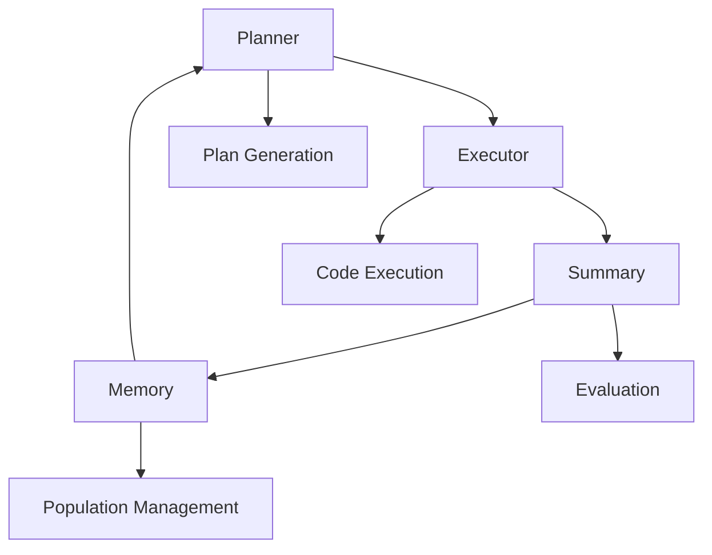

# General Evolve Paradigm

The General Evolve paradigm is LoongFlow's core approach for solving complex optimization problems using evolutionary algorithms with the Plan-Execute-Summary (PES) cycle.

## 🎯 When to Use This Paradigm

**Ideal for:**
- Mathematical optimization problems
- Algorithm design and improvement  
- Code generation with clear evaluation metrics
- Problems with well-defined fitness functions
- Multi-objective optimization tasks

**Examples from the repository:**
- `math_flip`: Mathematical function optimization
- `packing_circle_in_unit_square`: Geometric packing problems
- `heilbronn_problem`: Mathematical number theory problems

## 🏗️ Architecture Overview



### Core Components

**Planner**
- Generates evolutionary strategies
- Plans mutation and crossover operations
- Manages exploration vs exploitation balance

**Executor**  
- Executes generated code solutions
- Manages sandboxed execution environments
- Handles timeout and error recovery

**Summary**
- Evaluates solution fitness
- Generates insights for next iteration
- Manages population selection

**Memory**
- Stores solution population
- Manages island-based evolution
- Handles checkpoint persistence

## ⚙️ Configuration Example

```yaml
# task_config.yaml
workspace_path: "./output"

# LLM Configuration
llm_config:
  url: "http://your-llm-api/v1"
  api_key: "your-api-key"
  model: "deepseek-r1-250528"
  temperature: 0.7
  max_tokens: 4000

# Evolution Configuration
evolve:
  task: "Optimize the given mathematical function"
  planner_name: "evolve_planner"
  executor_name: "evolve_executor_fuse" 
  summary_name: "evolve_summary"
  max_iterations: 1000
  target_score: 0.95
  concurrency: 1

  # Evaluator settings
  evaluator:
    timeout: 1200

  # Population management
  database:
    storage_type: "in_memory"
    num_islands: 3
    population_size: 100
    checkpoint_interval: 10
```

## 🚀 Running an Agent

### Basic Execution
```bash
python general_evolve_agent.py \
    --config task_config.yaml \
    --task-file description.md \
    --eval-file evaluator.py \
    --max-iterations 500 \
    --log-level INFO
```

### With Custom Components
```bash
python general_evolve_agent.py \
    --config config.yaml \
    --planner custom_planner \
    --executor custom_executor \
    --summary custom_summary \
    --initial-file initial_solution.py
```

### Resume from Checkpoint
```bash
python general_evolve_agent.py \
    --config config.yaml \
    --checkpoint-path ./output/database/checkpoints/checkpoint-iter-150
```

## 📁 File Structure for Tasks

```
your_task/
├── task_config.yaml          # Evolution configuration
├── description.md            # Problem description
├── evaluator.py             # Evaluation logic
├── initial_solution.py      # Optional starting point
└── requirements.txt         # Python dependencies
```

### Evaluation Function Template
```python
# evaluator.py
def evaluate(solution_code: str) -> dict:
    """
    Evaluate a solution and return scoring metrics.
    
    Args:
        solution_code: Python code string to evaluate
        
    Returns:
        dict with keys: score (0.0-1.0), metrics, summary
    """
    try:
        # Execute the solution code
        # Compare against expected results
        # Calculate fitness score
        
        return {
            "score": 0.85,  # Between 0.0 and 1.0
            "metrics": {
                "accuracy": 0.92,
                "efficiency": 0.78
            },
            "summary": "Solution performs well but can be optimized",
            "status": "success"
        }
    except Exception as e:
        return {
            "score": 0.0,
            "metrics": {"error": str(e)},
            "summary": "Solution execution failed",
            "status": "error"
        }
```

## 🔧 Advanced Configuration

### Multiple Islands Configuration
```yaml
database:
  num_islands: 5
  population_size: 50
  migration_interval: 20
  migration_rate: 0.1
```

### Custom Evolutionary Parameters
```yaml
evolve:
  mutation_rate: 0.1
  crossover_rate: 0.8
  elitism_count: 5
  exploration_rate: 0.3
```

### Component-Specific Settings
```yaml
planners:
  evolve_planner:
    max_planning_steps: 10
    temperature: 0.8

executors:
  evolve_executor_fuse:
    timeout: 1800
    max_retries: 3

summarizers:
  evolve_summary:
    analysis_depth: "detailed"
```

## 📊 Monitoring and Visualization

### Real-time Monitoring
```bash
# Tail logs to monitor progress
tail -f output/logs/evolux.log

# Check population statistics
python -c "
from agentsdk.memory import MemoryFactory
memory = MemoryFactory()
print(memory.memory_status())
"
```

### Visualization Dashboard
```bash
cd visualizer
python visualizer.py --port 8888 --checkpoint-path output/database/checkpoints
```

## 🎯 Best Practices

### Problem Formulation
1. **Clear Evaluation**: Ensure your evaluator provides meaningful fitness scores
2. **Incremental Difficulty**: Start with simpler versions of complex problems
3. **Constraint Handling**: Clearly define constraints in the problem description

### Performance Optimization
1. **Island Tuning**: Use 3-5 islands for most problems
2. **Population Size**: Start with 50-100 individuals
3. **Checkpoint Frequency**: Save every 10-20 iterations

### Error Handling
```python
# Robust evaluator design
def safe_evaluate(solution_code):
    try:
        # Isolated execution environment
        with timeout(30):  # 30-second timeout
            return evaluate_solution(solution_code)
    except TimeoutError:
        return {"score": 0.0, "status": "timeout"}
    except Exception as e:
        return {"score": 0.0, "status": "error", "error": str(e)}
```

## 🚨 Troubleshooting

### Common Issues

**Low Convergence**
- Increase population size or number of islands
- Adjust mutation/crossover rates
- Improve evaluation function granularity

**Memory Issues**
- Reduce population size for large problems
- Use Redis backend for persistent storage
- Implement solution pruning

**Execution Errors**
- Add timeout protection in evaluator
- Validate solution code syntax before execution
- Use sandboxed execution environments

### Debugging Tips
```bash
# Enable debug logging
python general_evolve_agent.py --log-level DEBUG

# Test evaluator independently
python -c "
from evaluator import evaluate
print(evaluate('def solution(): return 42'))
"
```

This paradigm provides a robust foundation for evolutionary optimization problems with clear evaluation criteria and structured improvement cycles.