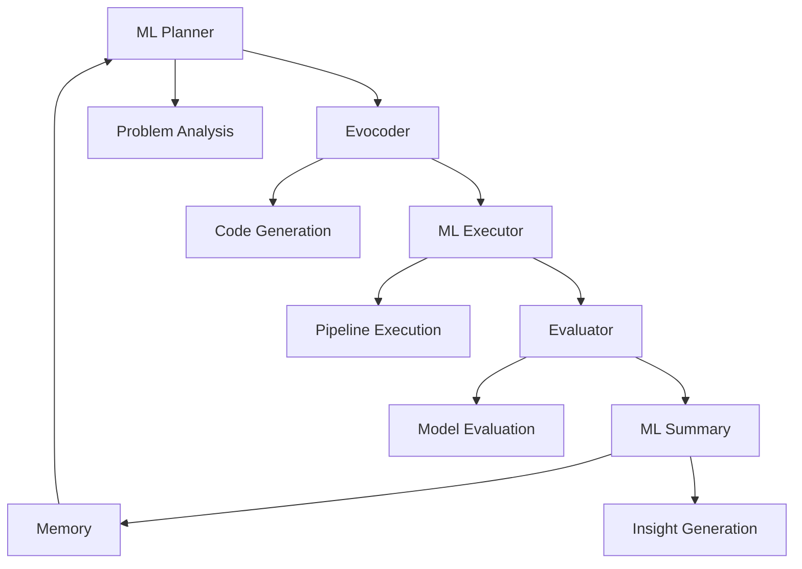

# ML Evolve Paradigm

The ML Evolve paradigm specializes in automated machine learning tasks, providing a complete AutoML pipeline for Kaggle-style competitions and MLE-Bench problems.

## 🎯 When to Use This Paradigm

**Ideal for:**
- Machine learning competitions (Kaggle, MLE-Bench)
- Automated feature engineering and model selection
- End-to-end ML pipeline generation
- Hyperparameter optimization
- Multi-modal ML problems

**Examples from the repository:**
- `ml_example`: Iris classification demo
- `mlebench`: MLE-Bench competition tasks
- Custom ML competition setups

## 🏗️ Architecture Overview



### Specialized Components

**ML Planner**
- Analyzes dataset characteristics
- Plans ML pipeline strategies
- Determines feature engineering approaches

**Evocoder**
- Generates ML-specific code
- Creates data preprocessing pipelines
- Designs model architectures

**ML Executor**
- Executes ML training pipelines
- Manages GPU/CPU resource allocation
- Handles large dataset processing

**ML Evaluator**
- Evaluates model performance
- Calculates competition metrics
- Validates submission formats

## ⚙️ Configuration Example

```yaml
# task_config.yaml
workspace_path: "./output"

# LLM Configuration
llm_config:
  url: "http://your-llm-api/v1"
  api_key: "your-api-key"
  model: "openai/gemini-3-flash-preview"
  temperature: 0.8
  context_length: 128000
  max_tokens: 32768

# ML-Specific Components
planners:
  ml_planner:
    react_max_steps: 10
    evo_coder_timeout: 3600

executors:
  ml_executor:
    react_max_steps: 10
    evo_coder_timeout: 86400

summarizers:
  ml_summary:
    react_max_steps: 10

# Evolution Configuration
evolve:
  planner_name: "ml_planner"
  executor_name: "ml_executor"
  summary_name: "ml_summary"
  max_iterations: 100
  target_score: 1.0
  concurrency: 1

  # ML-specific evaluator
  evaluator:
    timeout: 1800

  # Enhanced population management
  database:
    storage_type: "in_memory"
    num_islands: 3
    population_size: 30
    checkpoint_interval: 5
    sampling_weight_power: 1.0
```

## 🚀 Running an ML Agent

### MLE-Bench Competition
```bash
# Initialize environment
./run_mlebench.sh init

# Prepare competition data
./run_mlebench.sh prepare detecting-insults-in-social-commentary

# Run evolution
./run_mlebench.sh run detecting-insults-in-social-commentary --background

# Monitor progress
tail -f output/logs/evolux.log

# Stop when complete
./run_mlebench.sh stop detecting-insults-in-social-commentary
```

### Custom ML Task
```bash
# Initialize environment
./run_ml.sh init

# Run custom task
./run_ml.sh run ml_example --background

# Check results
ls output/ml_example_*/iterations/
```

## ?? ML Task Structure

```
your_ml_task/
├── task_config.yaml          # ML-specific configuration
├── eval_program.py           # Competition scoring logic
├── public/
│   ├── description.md        # Task description (visible to agent)
│   ├── train.csv             # Training data
│   ├── test.csv              # Test features  
│   └── sample_submission.csv # Expected submission format
└── private/
    └── answer.csv            # Ground truth (hidden from agent)
```

### Evaluation Program Template
```python
# eval_program.py
def evaluate(task_data_path: str, best_code_path: str, artifacts: dict) -> dict:
    """
    Evaluate ML solution against ground truth.
    
    Args:
        task_data_path: Path to task data directory
        best_code_path: Path to best generated code
        artifacts: Additional artifacts from execution
        
    Returns:
        dict with competition metrics
    """
    import pandas as pd
    from sklearn.metrics import accuracy_score, f1_score
    
    # Load ground truth
    answer_path = f"{task_data_path}/private/answer.csv"
    answers = pd.read_csv(answer_path)
    
    # Load predictions from generated code
    # (The agent's code should produce predictions)
    predictions = load_predictions(best_code_path)
    
    # Calculate competition metrics
    accuracy = accuracy_score(answers['target'], predictions)
    f1 = f1_score(answers['target'], predictions, average='macro')
    
    return {
        "status": "success",
        "summary": f"Model achieved {accuracy:.4f} accuracy",
        "score": accuracy,  # Primary competition metric
        "metrics": {
            "accuracy": accuracy,
            "f1_score": f1,
            "submission_valid": True
        },
        "artifacts": artifacts
    }
```

## 🔧 Advanced ML Configuration

### GPU Configuration
```yaml
# environment_gpu.yaml
cuda_visible_devices: "0"
batch_size: 32
num_workers: 4
mixed_precision: true
```

### Competition-Specific Settings
```yaml
evolve:
  competition_type: "classification"  # or regression, ranking
  evaluation_metric: "accuracy"       # Primary metric to optimize
  time_budget: 86400                 # 24-hour time limit
  memory_budget: "16GB"              # Memory constraint
```

### Model Selection Strategy
```yaml
ml_planner:
  model_families: ["tree", "linear", "neural", "ensemble"]
  feature_engineering: ["auto", "manual", "neural"]
  hyperparameter_search: "bayesian"  # or random, grid
```

## 📊 ML-Specific Monitoring

### Competition Progress Tracking
```bash
# Monitor iteration progress
tail -f output/your_task_uuid/logs/iteration_*.log

# Check model performance
python -c "
import json
with open('output/your_task_uuid/evaluate/latest_results.json') as f:
    results = json.load(f)
print(f'Best score: {results[\"best_score\"]}')
"
```

### Resource Monitoring
```bash
# GPU utilization
nvidia-smi

# Memory usage
ps aux | grep python | grep ml_evolve
```

## 🎯 ML Best Practices

### Data Preparation
1. **Data Profiling**: Include EDA in the planning phase
2. **Feature Validation**: Ensure feature engineering is reproducible
3. **Cross-Validation**: Use proper validation strategies

### Model Development
1. **Baseline Establishment**: Start with simple models
2. **Incremental Improvement**: Build complexity gradually
3. **Ensemble Strategies**: Leverage multiple model types

### Competition Strategy
```python
# Effective evaluation function
def competition_evaluator(predictions, ground_truth):
    """Competition-specific evaluation logic"""
    # Implement competition scoring rules
    # Handle multi-metric optimization
    # Validate submission format compliance
    pass
```

## 🔄 MLE-Bench Integration

### Supported Competitions
LoongFlow ML Evolve supports all MLE-Bench competitions:
- Text classification
- Image recognition
- Time series forecasting
- Recommendation systems

### Competition Workflow
```bash
# List available competitions
./run_mlebench.sh list

# Download and run specific competition
./run_mlebench.sh prepare competition-name
./run_mlebench.sh run competition-name

# Check leaderboard position
./run_mlebench.sh status competition-name
```

## 🚨 ML-Specific Troubleshooting

### Common ML Issues

**Overfitting**
- Increase validation rigor
- Implement early stopping
- Use regularization techniques

**Data Leakage**
- Strict train/test separation
- Temporal validation for time series
- Cross-validation best practices

**Resource Constraints**
- Optimize batch sizes
- Use memory-efficient data types
- Implement checkpointing for long trainings

### Performance Optimization
```yaml
# Optimized configuration
ml_executor:
  use_gpu: true
  batch_size: 64
  early_stopping_patience: 10
  model_checkpointing: true
```

### Debugging ML Pipelines
```bash
# Test data loading
python -c "import pandas as pd; df = pd.read_csv('public/train.csv'); print(df.shape)"

# Validate evaluation function
python eval_program.py --test
```

The ML Evolve paradigm provides a comprehensive AutoML solution for competitive machine learning tasks with specialized components for data science workflows.