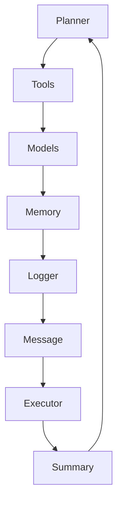

# Components Overview

LoongFlow is built on a modular architecture with several key components that work together to enable the Plan-Execute-Summary (PES) paradigm. Each component has a specific responsibility and can be extended or customized.

## Core Components

### 🧠 Memory
Handles state management for evolutionary algorithms, including:
- **Evolution Memory**: Storage for solutions, population management, and island-based evolution
- **Grade Memory**: Compressed storage for message history and grading results
- **Checkpoint Management**: Save and restore evolutionary progress

### 🛠️ Tools
Provides extensible tool interfaces for agent actions:
- **File Operations**: Read, write, and list files
- **Code Execution**: Execute Python code in controlled environments  
- **Shell Commands**: Run system commands safely
- **Custom Tools**: Extensible interface for domain-specific tools

### 📝 Logger
Comprehensive logging system for agent execution:
- **Structured Logging**: JSON-formatted logs with context
- **Multi-level Logging**: DEBUG, INFO, WARNING, ERROR levels
- **Rotating Logs**: Automatic log rotation and management

### 📨 Message
Message passing and content management:
- **Message Types**: Structured message formats for agent communication
- **Content Elements**: Rich content types including code, text, and data
- **Serialization**: Efficient message serialization/deserialization

### 🤖 Models
LLM integration and management:
- **Model Abstraction**: Unified interface for different LLM providers
- **Request/Response**: Structured LLM request and response handling
- **Tool Integration**: Support for tool calling and function calling

### 🔑 Token
Token management and counting:
- **Tokenization**: Support for different tokenization schemes
- **Budget Management**: Runtime token budget tracking
- **Optimization**: Token usage optimization strategies

## Component Interaction

## Customization

Each component can be customized by:
1. **Configuration**: Modify component behavior via YAML config
2. **Subclassing**: Extend base classes with custom logic
3. **Plugin System**: Implement new components following interface contracts

See individual component documentation for detailed usage and extension guides.
