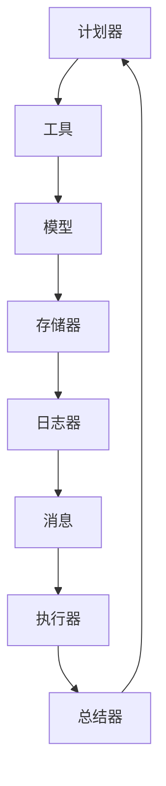

# 组件概览

LoongFlow 基于模块化架构构建，包含多个关键组件协同工作以实现计划-执行-总结（PES）范式。每个组件都有特定的职责，并且可以扩展或自定义。

## 核心组件

### 🧠 存储器（Memory）
处理进化算法的状态管理，包括：
- **进化存储器**：解决方案存储、种群管理和基于岛屿的进化
- **等级存储器**：消息历史和评分结果的压缩存储  
- **检查点管理**：保存和恢复进化进度

### 🛠️ 工具（Tools）
为智能体操作提供可扩展的工具接口：
- **文件操作**：读取、写入和列出文件
- **代码执行**：在受控环境中执行Python代码
- **Shell命令**：安全运行系统命令
- **自定义工具**：领域特定工具的可扩展接口

### 📝 日志器（Logger）
智能体执行的全面日志系统：
- **结构化日志**：带有上下文的JSON格式日志
- **多级日志**：DEBUG、INFO、WARNING、ERROR等级别
- **日志轮转**：自动日志轮转和管理

### 📨 消息（Message）
消息传递和内容管理：
- **消息类型**：智能体通信的结构化消息格式
- **内容元素**：丰富的类型，包括代码、文本和数据
- **序列化**：高效的消息序列化/反序列化

### 🤖 模型（Models）
LLM集成和管理：
- **模型抽象**：不同LLM提供商的统一接口
- **请求/响应**：结构化的LLM请求和响应处理
- **工具集成**：支持工具调用和函数调用

### 🔑 Token管理（Token）
令牌管理和计数：
- **令牌化**：支持不同的令牌化方案
- **预算管理**：运行时令牌预算跟踪
- **优化**：令牌使用优化策略

## 组件交互

## 自定义

每个组件可以通过以下方式自定义：
1. **配置**：通过YAML配置修改组件行为
2. **子类化**：使用自定义逻辑扩展基类
3. **插件系统**：遵循接口合约实现新组件

查看各个组件的文档了解详细使用和扩展指南。
